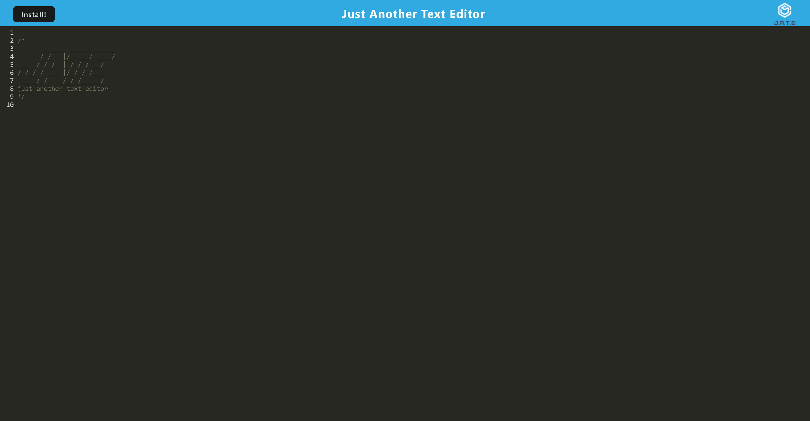

# progressive-web-applications-text-editor
Ch 19 for OSU bootcamp

## Table of Contents

- [Description](#description)
- [Installation](#installation)
- [Usage](#usage)
- [Questions](#questions)

## Description
J.A.T.E. or Just Another Text Editor is simply a text editor with added features. It supports Javascript syntax formatting, allowing you to practice your Javascript coding either within the browser or by installing the app to work offline.

## Installation

1. Access J.A.T.E. in the browser via this heroku build app - [PWA](https://pwa-0527.herokuapp.com/)
2. Click Install to add to your computer

## Usage

1. Use the app locally
2. Write text for notation, items will save automatically.

## Questions
- Reach me at the following:

Github: [Projectmayhem90](https://github.com/Projectmayhem90)